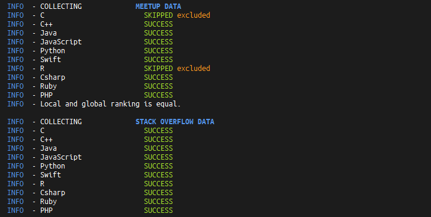
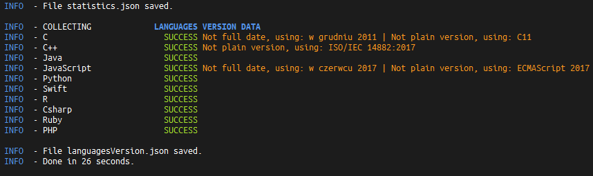

# Programing languages statistics scraper

Tool which collects (scraps from web) statistics for programing languages in need for my site [jaki-jezyk-programowania.pl](https://jaki-jezyk-programowania.pl/).

Currently, the tool is fetching data for each language from:
- [Github](https://github.com/)
    * top 10 projects
    * number of projects
    * number of projects with more than 500 stars
 - [Meetup.com](https://www.meetup.com/pl-PL/topics/JavaScript)
    * number of members
    * number of meetups
 - [StackOverflow](https://stackoverflow.com)
     * number of tagged questions
 - [Wikipedia](https://en.wikipedia.org/wiki/Main_Page)
    * latest language version
 - [Tiobe INDEX](https://www.tiobe.com/tiobe-index/)
    * position at last year
    * position at this year
 - [Spectrum ranking](https://spectrum.ieee.org/static/interactive-the-top-programming-languages-2017)
    * position at last year
    * position at this year
 
 Everything is stored in two json files:
    - statistics.json
    - languagesVersions.json
    
 If statistics.json already exists, then it will be renamed (date will be appended) and fresh one will be created as statistics.json.

## Getting Started

These instructions will get you a copy of the project up and running on your local machine for development and testing purposes.

### Prerequisites

```
- Java 8+
- Maven (Development)
- Github account (if you want to collect data from Github)
```

## Demo

If you want to just demo test run this bat file:

```
demo/stats-scraper-demo.bat
```

or manually in cmd from project directory

```
java -jar stats-scraper-1.0.0.jar -nogit
```

(Github data will be skipped)

Note:
```
If you will run this tool more than once within short time then errors occurs due to api restrictions. 

Also you cannot have more than one file created in the same day. You need to remove or move old file with appended date if you want to get fresh data in that day.
```
### Installing

Install maven dependencies

```
mvn install
```

Provide github authentication token under `src\main\resources\config.properties` if u want to fetch data from Github

Follow this [guide](https://help.github.com/articles/creating-a-personal-access-token-for-the-command-line/) if u don't have token.

```
GithubAuthToken=token 22sadasdsa34r32412342134214324123
```

Otherwise, you need to pass parameter `-nogit` when you are running program:
```
java -jar stats-scraper-1.0.0.jar -nogit
```
or remove lines where `GithubDataScraper` is added to `StatisticsBuilder` at `App` class.

If you want to regenerate jar file to use it as single file application run:

```
mvn packege
```
(it goes under target/stats-scraper-1.0.0.jar)

Sample output of tool:




## Built With

* [Maven](https://maven.apache.org/) - Dependency management and build tool.
* [Jsoup](https://jsoup.org/) - Used to parse HTML websites.
* [Json smart](https://netplex.github.io/json-smart/) - Working with JSONObjects.
* [Apache Commons](https://commons.apache.org/) - helper libs for validating data.
* [Logback](https://commons.apache.org/) - status logging.
